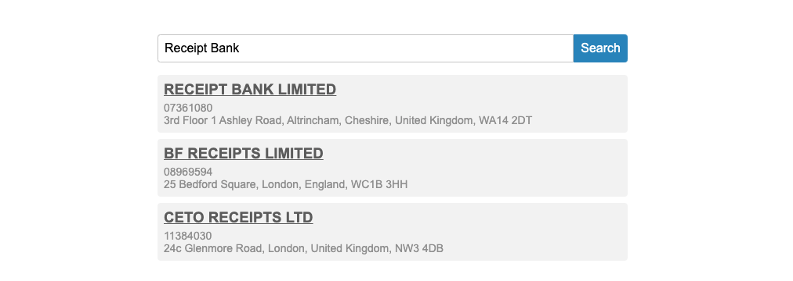

# DIY task (The company house)
As a part of this interview stage, we would like to give you a coding task whose solution will be the main topic of our next conversation.

## Instructions
There is a public register with all UK companies which can be downloaded from [here](http://download.companieshouse.gov.uk/en_output.html). Implement a web application that will provide a UI for searching in it.

### UI/UX Design
The required UI is quite simple - a text input for the search string with a submit (search) button on the right side.

#### Loading state
When a search is executed the UI should enter a loading state. The input and the button should be disabled and the text of the button should change to "Searching..."

#### Search results
When search results are found they should be displayed (name, company number, address) below the search area.

#### No results found
When no companies are found a text communicating this should be displayed below the search area.

### Frontend
The main requirement for the front end of the application is that it should behave as a single page application, meaning that there should not be a full-page reload when a search is executed.

### Backend
There are no specific requirements. It is up to you to decide where the data will reside (importing it in a database is preferred), how is it going to be organized and how the search will be implemented. Since your solution will be the topic of our next conversation it is recommended that you use technologies with which you are experienced. You should be able to reason about your decisions and make changes if required.

### Git
The solution should be available in a public git (Github/Gitlab/Bitbucket) repository. Make sure that there is a good git history where the evolution of the project could be followed.

### Tests
Cover the application with a sufficient amount of tests.
